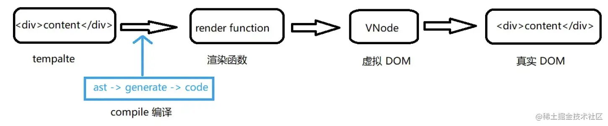

# Vue

## 高频

### 组件间通讯方式

思路

1. 总述知道的所有方式

2. 按组件关系阐述使用场景

<details class="details-block"><summary>答案</summary>

组件间通讯分类


- 父子组件
- 兄弟组件
- 祖孙组件
- 非关系组件

常见通讯方式

1. `props` 传递 - 父子
2. `$emits` 触发 - 子父
3. `ref` - 父子
4. `eventBus` - 兄弟
5. `$parent` 和 `$root` - 兄弟
6. `$attrs` 与 `$listeners` - 祖先传给子孙
7. `provide` 和 `inject` - 祖先传给子孙
8. `vuex` - 任意组件传值

> $parent 和 $root:通过共同 $parent 或 $root

</details>

### 生命周期及每个阶段做的事

思路

1. 给出概念
2. 列举生命周期各阶段
3. 阐述整体流程
4. 结合实践
5. 扩展：vue3 变化

<details class="details-block"><summary>答案</summary>

1. 每个 Vue 组件实例被创建后都会经过一系列初始化步骤，比如，**数据观测，模板编译，挂载实例到 dom 上，以及数据变化时更新 dom**。这个过程会运行叫做生命周期钩子的函数，以便开发者在特定的阶段做特定的事情。
2. 生命周期总共可以分为 8 个阶段：**创建前后, 载入前后, 更新前后, 销毁前后**。

3. 具体描述

| 生命周期 v2   | 生命周期 v3         | 描述                                                         |
| ------------- | ------------------- | ------------------------------------------------------------ |
| beforeCreate  | -                   | 在实例初始化之后**，数据观测 (data observer) 和 event/watcher 事件配置之前**被调用。 |
| created       | -                   | 实例**创建完成后**被立即调用。                               |
| beforeMount   | -                   | 挂载开始之前被调用，相关的 **render 函数首次被调用**。       |
| mounted       | -                   | 挂载完成后被调用，这时**组件已经被挂载到了 DOM 上**。        |
| beforeUpdate  | -                   | 数据更新时调用，发生在**虚拟 DOM 重新渲染和打补丁之前**。    |
| updated       | -                   | 数据更新之后调用，发生**在虚拟 DOM 重新渲染和打补丁之后**。  |
| beforeDestroy | **beforeUnmount**   | 组件实例销毁之前                                             |
| destroyed     | **unmounted**       | 组件实例销毁之后                                             |
| activated     | -                   | keep-alive 缓存的组件激活时                                  |
| deactivated   | -                   | keep-alive 缓存的组件停用时调用                              |
| errorCaptured | -                   | 捕获一个来自子孙组件的错误时被调用                           |
| -             | **renderTracked**   | 调试钩子，响应式依赖被收集时调用                             |
| -             | **renderTriggered** | 调试钩子，响应式依赖被触发时调用                             |
| -             | **serverPrefetch**  | ssr only，组件实例在服务器上被渲染前调用                     |

vue3 差异详解：

1. `beforeDestroy -> beforeUnmount` , `Destoryed -> Unmounted`
2. 新增了三个用于调试和服务端渲染场景 （`renderTracked、renderTriggered、serverPrefetch`）
3. composition 下新增 setup 函数在 `beforeCreate` 和 `created` 之前执行。`setupStatefulComponent`进行 setup 函数调用，之后在 `finishComponentSetup` 中 `applyOptions`中进行 `beforeCreate` 和 `created` 钩子函数调用

相关代码：

[setupStatefulComponent](https://github1s.com/vuejs/core/blob/HEAD/packages/runtime-core/src/componentOptions.ts)

[applyOptions](https://github1s.com/vuejs/core/blob/HEAD/packages/runtime-core/src/componentOptions.ts#L610)


补充：

在created 里面使用 nexttick 和 mounted 里面使用nexttick 有什么区别？

</details>

### 能说一说双向绑定使用和原理吗？

思路：

1. 双向绑定是什么
2. 双向绑定如何实现
3. vue2 和 vue3 差异

<details class="details-block"><summary>答案</summary>


**双向绑定**是指**数据模型（Model）和视图（View）之间的自动同步机制**，即数据变化视图更新，反之，视图变化数据也更新

Vue 数据双向绑定原理是通过 **数据劫持** + **发布订阅模式** 的方式来实现。

发布/订阅模式：主要**负责维护订阅者列表和通知订阅者更新**

数据劫持：主要用于**监听数据变化并触发通知更新**的机制


**`vue2` 中表现**

**数据劫持** ：使用 `Object.defineProperty()` 方法，将每个属性转换为访问器属性，并重写其 getter 和 setter 方法。

**发布订阅模式**：使用 `Dep` 对象来实现发布订阅模式。在 `Dep` 中，每个订阅者都需要提供一个 `update` 方法，用来接收数据变化的通知。当数据发生变化时，`Dep` 对象会遍历订阅者列表，调用每个订阅者的 update 方法，以便更新其对应的视图。每个响应式属性都对应着一个 `Dep` 对象，用来维护与该属性相关的订阅者列表。


**`vue3` 中表现**

**数据劫持**：使用 `Proxy` 对象实现数据劫持。可以监听整个对象而不仅仅是属性，可以监听数组的变化，可以使用 Reflect 对象进行反射操作等等。

**发布订阅模式**：使用了 `ReactiveEffect` 类来实现响应式数据的管理，支持更加灵活和高效的副作用管理。在 `ReactiveEffect` 中，每个副作用函数都可以**通过 `track` 方法来关联一个响应式对象的属性，并将自己添加到该属性的依赖列表中**。当**属性发生变化时**，`ReactiveEffect` 对象会**自动触发**所有与该属性关联的副作用函数，并执行它们的操作。


相关代码：

[Dep 对象](https://github1s.com/vuejs/vue/blob/HEAD/src/core/observer/dep.ts#L31)

[ReactiveEffect对象](https://github1s.com/vuejs/vue/blob/HEAD/src/core/observer/index.ts) 

</details>

### vue 响应式的理解

思路：

1. 响应式是什么
2. 响应式如何实现
3. vue2 和 vue3 有什么差异

<details class="details-block"><summary>答案</summary>


响应式指是 Vue 中的**数据发生变化时，页面上相应的内容会自动更新**，从而实现了数据与视图的同步。

响应式实现：通过**数据劫持**来完成的。当一个 Vue 实例创建时，Vue 会**遍历 data 选项中的所有属性，为对象的每个属性设置 getter 和 setter，从而追踪属性的读取和修改，并在属性发生变化时通知相关的视图更新**。

当页面上某个**数据被修改**时，Vue 会通过**依赖追踪**（`Dependency Tracking`）的方式**自动追踪这个数据的依赖关系**，把**依赖这个数据的所有组件全部记录下来**。

当这个数据发生变化时，Vue 会**遍历这个数据的依赖关系**，重新计算所有依赖这个数据的组件，最终把这些组件全部更新。


vue2

数据响应式会根据数据类型来做不同处理。

**对象**：采用`Object.defineProperty()`的方式定义数据拦截
**数组**：**覆盖数组对象原型的7个变更方法**

缺点：

1. 一次只能监听一个属性，多个属性需要使用循环。初始化时的**递归遍历会造成性能损失**；
2. **新增或删除属性**无法处理，需要使用`Vue.set/delete`
3. `Map、Set`这些数据结构不支持等问题

> 误区：数组中索引访问或设置对应元素的值时，可以触发 `getter` 和 `setter` 方法。


vue3

利用ES6的Proxy代理要响应化的数据，初始化性能和内存消耗都得到了大幅改善。响应化实现代码抽取为独立的reactivity包

补充问题：

响应式理解：

1. data中有a属性，通过 `this.a` 修改值，会不会触发 `beforeUpdate` 和 `render`。（a属性未在template使用）
2. 假设 `this.a = 2`，我将 this.a 再次赋值为2，会触发 `beforeUpdate` 吗？

> Object.is


相关源码：

https://github1s.com/vuejs/vue/blob/HEAD/src/core/observer/index.ts

</details>


### 虚拟 DOM 的理解？

思路

1. vdom是什么
2. 引入vdom的好处
3. vdom如何生成，又如何成为dom
4. 在后续的diff中的作用


<details class="details-block"><summary>答案</summary>


虚拟dom（虚拟dom对象），是一个 JavaScript 对象，通过不同的属性描述视图对象。

引入**vdom好处**：

好处一：直接操作dom很慢，操作js对象很快。将真实元素节点抽象成 VNode，有效**减少直接操作 `dom` 次数**，从而提高程序性能

1. **操作 dom 是有限制**。一个真实元素上有许多的内容，如果直接对其进行 diff 操作，会去额外 diff 一些没有必要的内容。进行 clone 那么需要将其全部内容进行复制。
2. **操作 dom 比较昂贵**。**频繁的`dom`操作容易引起页面的重绘和回流**，但是通过抽象 VNode 进行中间处理，可以有效减少直接操作dom的次数，从而减少页面重绘和回流。

好处二：方便实现跨平台

1. vnode 可以渲染成不同平台上的对应的内容。比如：渲染在浏览器是 dom 元素节点，渲染在 Native( iOS、Android) 变为对应的控件、可以实现 SSR 、渲染到 WebGL 中等等。
2. vue3 中允许开发者基于 VNode 实现自定义渲染器（renderer），以便于针对不同平台进行渲染。


vdom如何生成？

1. 模板 `template`会编译为 `render` 函数（`ast->generate->code`）
2. 挂载（mount）过程中会调用`render`函数，返回的对象就是 虚拟`dom`。
3. 通过 patch 函数将 vdom 进一步转化为 dom，并插入到页面。
5. 挂载过程结束后，vue程序进入更新流程。如果某些响应式数据发生变化，将会引起组件重新render，此时就会生成新的vdom，和上一次的渲染结果diff就能得到变化的地方，从而转换为最小量的dom操作，高效更新视图。



</details>


### patch 过程

1. patch 是什么
2. 如何比较节点
3. 和diff算法有什么关联

<details class="details-block"><summary>答案</summary>


组件渲染的过程分为两个阶段：**`mounting`（挂载）和 `updating`（更新**）。其中，挂载阶段是指组件第一次渲染到页面上的过程，更新阶段则是指组件在**数据发生变化时重新渲染**的过程。

在更新阶段中，Vue 会调用一个叫做 `patch` 的方法来比较新旧虚拟节点（Virtual DOM），并将差异应用到真实的 DOM 上，从而实现视图的更新。

**patch 过程**：当 Vue 生成一个新的 vdom 树后，它会把它与旧的 vdom 树进行比较，找出它们之间的差异，并把差异应用到真实 DOM 上，从而更新视图。


在 `patch` 方法内部，会根据虚拟节点的类型执行不同的操作。

- 新旧虚拟节点都是**文本节点**，那么 `patch` 方法会直接更新文本节点的内容。

- 新旧虚拟节点都是**普通 HTML 标签**，那么 `patch` 方法会递归比较它们的子节点，并对子节点进行相应的操作（添加、删除、更新等）。

- 新旧虚拟节点都是**组件节点**，那么 `patch` 方法会执行一系列的生命周期钩子函数，以及更新组件实例的 props 和 data 等属性。    


补充：

和diff算法有什么关联

vue patch 是 vue 的**渲染机制**，它使用了一种基于虚拟 DOM 树的 diff 算法，来比较新旧节点的差异，并根据差异更新真实的 DOM 节点。

vue diff 算法有一些特殊的优化策略，比如只比较同层级的节点，使用 key 属性来标识节点，分别处理静态节点和动态节点等。

**vue patch 是基于 diff 算法的一种应用**，而 diff 算法是一种更广泛的概念。

</details>


### diff 算法

思路

1. diff算法是干什么的
2. diff算法执行过程
3. diff算法比较过程
5. 说一下vue3中的优化


<details class="details-block"><summary>答案</summary>


diff 算法是一种用于**比较两棵虚拟 `DOM` 树的差异**，并根据差异更新真实的 DOM 节点的算法。它的目的是提高渲染性能，避免不必要的 DOM 操作。


**`diff`执行时机取决于数据的变化**，当数据发生变化时，vue 会触发响应式系统，通知所有订阅者（watcher），订阅者会调用 patch 函数，执行 diff 算法，并更新视图。

具体流程如下

1. 组件内响应式数据变更触发实例**执行其更新函数**时，更新函数会再次**执行render函数**获得最新的虚拟DOM
3. 然后**执行patch函数**，并传入新旧两次虚拟DOM，通过比对两者找到变化的地方，最后将其转化为对应的DOM操作。


`patch`函数中是遵循**深度优先、同层比较**策略；

1. 比较新旧两棵虚拟 DOM 树的根**节点**，如果它们不同，直接用新的根节点替换旧的根节点。
2. 如果两棵树的根节点相同，比较它们的**子节点**。diff 算法只会**比较同层级的子节点**，忽略跨层级的操作。

2. 对于同层级的子节点，采用**双端比较的策略**，即同时**从头部和尾部开始比较**，找到相同或不同的节点，并进行相应的操作。

3. 如果头部和尾部都没有找到相同的节点，vue 会**使用 key 属性来标识节点，并通过哈希表来快速查找相同节点**，并进行移动或替换操作。
4. 如果还没有找到相同的节点，vue 会认为这是一个新的节点，并创建一个新的 DOM 节点。

> 深度优先：按照树的深度优先搜索的顺序进行比较，即从根节点开始，依次比较左子树和右子树的节点。
>
> 同层比较：只会比较同一层级的节点，不会跨层级比较，因为在前端操作DOM的时候，很少会跨越层级地移动DOM元素 。


在 vue3 中，diff 算法有了一些优化，主要有以下几点：

1. 引入**静态标记**（static flag）和**动态标记**（dynamic flag）来区分静态节点和动态节点，并只对动态节点进行。
2. 引入**片段**（fragment）来处理**多个根节点**的情况，并避免多余的包裹元素。
3. 引入**快速 diff 算法**（fast diff algorithm）来处理列表渲染中常见的操作模式，并提高性能。


> 快速diff算法：
>
> - 预处理：在**比较之前**，先对新节点数组进行预处理，生成一个以key为索引，以索引为值的对象，方便后续查找 。
> - 源数组：在**比较过程**，维护一个源数组，用于记录旧节点数组中已经被匹配过的节点的位置，方便后续判断是否需要移动 。
> - 最长递增子序列：在比较过程中，发现新节点数组中有多个节点可以复用旧节点数组中的节点，那么就利用最长递增子列算法来找出最大的不需要移动的节点集合，从而减少移动次数。


补充：

diff算法演变

最初Vue1.x视图中每个依赖均有更新函数对应，可以做到精准更新，因此并不需要虚拟DOM和patching算法支持，但是这样粒度过

导致Vue1.x无法承载较大应用；

Vue 2.x中为了降低`Watcher`粒度，**每个组件只有一个`Watcher`与之对应**，此时就需要**引入`patching`算法才能精确找**

**发生变化的地方并高效更新**。


相关源码：

[快速diff算法](https://github1s.com/vuejs/core/blob/HEAD/packages/runtime-core/src/renderer.ts#L1956)

</details>


### 11-vue3 新特性

https://juejin.cn/post/7097067108663558151#heading-52

<details class="details-block"><summary>答案</summary>


api层面Vue3新特性主要包括：Composition API、SFC Composition API语法糖、Teleport传送门、Fragments 片段、Emits选项、自定义渲染器、SFC CSS变量、Suspense

另外，Vue3.0在框架层面也有很多亮眼的改进：

更快

- 虚拟DOM重写
- 编译器优化：静态提升、patchFlags、block等
- 基于Proxy的响应式系统

更小：更好的摇树优化

更容易维护：TypeScript + 模块化

更容易扩展

- 独立的响应化模块
- 自定义渲染器

### 14-key 作用    
</details>


### 


<details class="details-block"><summary>答案</summary>

key的作用主要是为了更高效的更新虚拟DOM。

vue在patch过程中**判断两个节点是否是相同节点是key是一个必要条件**，渲染一组列表时，key往往是唯一标识，所以如果不定义key的话，vue只能认为比较的两个节点是同一个，哪怕它们实际上不是，这导致了频繁更新元素，使得整个patch过程比较低效，影响性能。

实际使用中在渲染一组列表时key必须设置，而且必须是唯一标识，应该避免使用数组索引作为key，这可能导致一些隐蔽的bug；vue中在使用相同标签元素过渡切换时，也会使用key属性，其目的也是为了让vue可以区分它们，否则vue只会替换其内部属性而不会触发过渡效果。

从源码中可以知道，vue判断两个节点是否相同时主要判断两者的key和元素类型等，因此如果不设置key，它的值就是undefined，则可能永远认为这是两个相同节点，只能去做更新操作，这造成了大量的dom更新操作，明显是不可取的。   
</details>


### 15-nextTick 使用和原理？

思路：

1. nextTick是做什么的？
2. 为什么需要它呢？
3. 开发时何时使用它？抓抓头，想想你在平时开发中使用它的地方
4. 下面介绍一下如何使用nextTick
5. 原理解读，结合异步更新和nextTick生效方式，会显得你格外优秀

<details class="details-block"><summary>答案</summary>
1. nextTick是**等待下一次 DOM 更新刷新的工具方法**。
2. Vue异步更新策略，**如果数据变化，Vue不会立刻更新DOM，而是开启一个队列，把组件更新函数保存在队列中，在同一事件循环中发生的所有数据变更会异步的批量更新**。这会导致对数据的修改不会立刻体现在DOM上，此时如果想要获取更新后的DOM状态，就需要使用nextTick。
3. 开发时，有**两个场景我们会用到`nextTick`**

- created中想要获取DOM时
- 响应式数据变化后获取DOM更新后的状态

4. nextTick签名如下：`funcion nextTick(callback?: () => void): Promise<void>`

   在传入的回调函数中访问最新DOM状态即可，或者我们可以`await nextTick()`方法返回的Promise之后做这件事。

5. 原理：**传入的callback会被添加到队列刷新函数(`flushSchedulerQueue`)的后面**，等队列内部的更新函数都执行完毕，所有DOM操作也结束了，callback自然能够获取到最新的DOM值。


</details>


### 17-Vue 子组件和父组件创建和挂载顺序


<details class="details-block"><summary>答案</summary>


创建过程自上而下，挂载过程自下而上；即：

- parent created
- child created
- child mounted
- parent mounted

之所以会这样是因为Vue创建过程是一个递归过程，先创建父组件，有子组件就会创建子组件，因此创建时先有父组件再有子组件；子组件首次创建时会添加mounted钩子到队列，等到patch结束再执行它们，可见子组件的mounted钩子是先进入到队列中的，因此等到patch结束执行这些钩子时也先执行。

</details>


### 18-怎么缓存当前的组件？缓存后怎么更新？

### 22-从 template 到 render 处理过程

<details class="details-block"><summary>答案</summary>
Vue中有个独特的编译器模块，称为“compiler”，它的主要作用是将用户编写的template编译为js中可执行的render函数。

之所以需要这个编译过程是为了便于前端程序员能高效的编写视图模板。相比而言，我们还是更愿意用HTML来编写视图，直观且高效。手写render函数不仅效率底下，而且失去了编译期的优化能力。

在Vue中编译器会先对template进行解析，这一步称为parse，结束之后会得到一个JS对象，我们成为抽象语法树AST，然后是对AST进行深加工的转换过程，这一步成为transform，最后将前面得到的AST生成为JS代码，也就是render函数。 

</details>


### 23-Vue 实例挂载的过程中发生了什么?


<details class="details-block"><summary>答案</summary>

挂载过程指的是app.mount()过程，这个过程中整体上做了两件事：**初始化**和**建立更新机制**

初始化会创建组件实例、初始化组件状态，创建各种响应式数据

建立更新机制这一步会立即执行一次组件更新函数，这会首次执行组件渲染函数并执行patch将前面获得vnode转换为dom；同时首次执行渲染函数会创建它内部响应式数据之间和组件更新函数之间的依赖关系，这使得以后数据变化时会执行对应的更新函数。

</details>


### 24-Vue 3 的设计目标是什么？做了哪些优化?

<details class="details-block"><summary>答案</summary>
Vue3的最大设计目标是替代Vue2（皮一下），为了实现这一点，Vue3在以下几个方面做了很大改进，如：易用性、框架性能、扩展性、可维护性、开发体验等

易用性方面主要是API简化，比如`v-model`在Vue3中变成了Vue2中`v-model`和`sync`修饰符的结合体，用户不用区分两者不同，也不用选择困难。类似的简化还有用于渲染函数内部生成VNode的`h(type, props, children)`，其中`props`不用考虑区分属性、特性、事件等，框架替我们判断，易用性大增。

开发体验方面，新组件`Teleport`传送门、`Fragments` 、`Suspense`等都会简化特定场景的代码编写，`SFC Composition API`语法糖更是极大提升我们开发体验。

扩展性方面提升如独立的`reactivity`模块，`custom renderer` API等

可维护性方面主要是`Composition API`，更容易编写高复用性的业务逻辑。还有对TypeScript支持的提升。

性能方面的改进也很显著，例如编译期优化、基于`Proxy`的响应式系统

。。。


</details>


### 25-你了解哪些 Vue 性能优化方法？

https://juejin.cn/post/7115055320913117220#heading-8

### 26-Vue 组件为什么只能有一个根元素?

https://juejin.cn/post/7115055320913117220#heading-12

### 35-什么是递归组件？举个例子说明下？

### 36-异步组件是什么？使用场景有哪些？

https://juejin.cn/post/7115055320913117220#heading-71

### 40-使用 vue 渲染大量数据时应该怎么优化？说下你的思路！

### 44-Vue3.0 性能提升体现在哪些方面？

<details class="details-block"><summary>答案</summary>
我分别从代码、编译、打包三方面介绍vue3性能方面的提升

代码层面性能优化主要体现在全新响应式API，基于Proxy实现，初始化时间和内存占用均大幅改进；

编译层面做了更多编译优化处理，比如静态提升、动态标记、事件缓存，区块等，可以有效跳过大量diff过程；

打包时更好的支持tree-shaking，因此整体体积更小，加载更快   
</details>


### 45-Vue3.0 里为什么要用 Proxy 替代 defineProperty ？


<details class="details-block"><summary>答案</summary>


JS中做属性拦截常见的方式有三：: [defineProperty](https://link.juejin.cn?target=https%3A%2F%2Fdeveloper.mozilla.org%2Fen-US%2Fdocs%2FWeb%2FJavaScript%2FReference%2FGlobal_Objects%2FObject%2FdefineProperty)，[getter](https://link.juejin.cn?target=https%3A%2F%2Fdeveloper.mozilla.org%2Fen-US%2Fdocs%2FWeb%2FJavaScript%2FReference%2FFunctions%2Fget)/[setters](https://link.juejin.cn?target=https%3A%2F%2Fdeveloper.mozilla.org%2Fen-US%2Fdocs%2FWeb%2FJavaScript%2FReference%2FFunctions%2Fset) 和[Proxies](https://link.juejin.cn?target=https%3A%2F%2Fdeveloper.mozilla.org%2Fen-US%2Fdocs%2FWeb%2FJavaScript%2FReference%2FGlobal_Objects%2FProxy).

Vue2中使用`defineProperty`的原因是，2013年时只能用这种方式。由于该API存在一些局限性，比如对于数组的拦截有问题，为此vue需要专门为数组响应式做一套实现。另外不能拦截那些新增、删除属性；最后`defineProperty`方案在初始化时需要深度递归遍历待处理的对象才能对它进行完全拦截，明显增加了初始化的时间。

以上两点在Proxy出现之后迎刃而解，不仅可以对数组实现拦截，还能对Map、Set实现拦截；另外Proxy的拦截也是懒处理行为，如果用户没有访问嵌套对象，那么也不会实施拦截，这就让初始化的速度和内存占用都改善了。

当然Proxy是有兼容性问题的，IE完全不支持，所以如果需要IE兼容就不合适


</details>


### 49-你觉得 vuex 有什么缺点？

### 介绍 render 函数，描述虚拟 dom 到真实 dom 的过程

### vue 中如何做 seo 优化

### 单页应用和多页应用的区别

## 对比

### vue2 和 vue3 的区别

<details class="details-block"><summary>答案</summary>
**响应性系统**：Vue 3 引入了 `Proxy` 对象作为响应式系统的基础，相较于 Vue 2 中使用的 `Object.defineProperty` 实现，Proxy 具有更好的性能和更丰富的 API。在 Vue 3 中，数据响应式的实现基于 Proxy 对象，可以监听到对象属性的任何变化，包括新增属性和删除属性，相比于 Vue 2 更加灵活。

**运行时**：Vue 3 的运行时体积缩小了约 40%。在 Vue 3 中，除了一些核心的 runtime-dom 和 runtime-core 之外，其他功能都可以通过使用 Tree-shaking 技术在打包时自动优化掉，避免了无用代码的加载，提高了性能。

**编译器**：Vue 3 引入了基于模板 AST 的**静态提升**（`Static Inlining`）和基于标记的**树摇优化**（`Mark-Element-Style`），这两个优化技术都可以**显著提高模板编译的性能和生成的代码质量**。

补充：静态提升和树摇优化

**静态提升**：将模板中的静态节点预编译成渲染函数中的常量，避免了重复的计算和创建 VNode 的开销，从而提高了应用的性能。

**树摇优化**：通过分析模板中的元素、指令和样式等信息，判断哪些是无用的，并将其优化掉。

补充：vue2 无法进行静态提升和树摇优化的原因

vue2 基于**字符串的模板编译**方式， Vue 3 基于**函数调用的模板编译**方式。

**模板字符串的编译过程在运行时进行，而函数编译可以在编译时完成。**

**模板字符串**在编译时会被解析成抽象语法树，然后在运行时根据这个抽象语法树动态生成代码。意味着在每次渲染过程中，都需要对整个模板进行解析，检查哪些部分需要更新，因此无法对模板进行静态优化，因此无法进行静态提升等优化。

**函数编译**在编译时静态分析模板中的静态内容，并将其直接编译为静态的渲染函数。在运行时只需要调用渲染函数即可，避免了每次渲染都需要解析模板的开销。

同时，在静态分析时，还可以进行树摇优化，去掉不需要的代码，进一步减少代码的大小和运行时的负担。

</details>

### 02-v-if 和 v-for 哪个优先级更高？

思路

1. 先给出结论
2. 为什么是这样的，说出细节
3. 哪些场景可能导致我们这样做，该怎么处理
4. 总结，拔高

### 16-watch 和 computed 的区别以及选择?

https://juejin.cn/post/7097067108663558151#heading-75

### 29-ref 和 reactive 异同

https://juejin.cn/post/7115055320913117220#heading-27

<details class="details-block"><summary>答案</summary>


`ref`接收内部值（inner value）返回响应式`Ref`对象，`reactive`返回响应式代理对象

从定义上看`ref`通常用于处理单值的响应式，`reactive`用于处理对象类型的数据响应式

两者均是用于构造响应式数据，但是`ref`主要解决原始值的响应式问题

ref返回的响应式数据在JS中使用需要加上`.value`才能访问其值，在视图中使用会自动脱ref，不需要`.value`；ref可以接收对象或数组等非原始值，但内部依然是`reactive`实现响应式；reactive内部如果接收Ref对象会自动脱ref；使用展开运算符(...)展开reactive返回的响应式对象会使其失去响应性，可以结合toRefs()将值转换为Ref对象之后再展开。

reactive内部使用Proxy代理传入对象并拦截该对象各种操作（trap），从而实现响应式。ref内部封装一个RefImpl类，并设置get value/set value，拦截用户对值的访问，从而实现响应式。


</details>


### 30-watch 和 watchEffect 异同

https://juejin.cn/post/7115055320913117220#heading-32

### 31-SPA、SSR 的区别是什么

### 39-vuex 中 actions 和 mutations 有什么区别？

### 46-History 模式和 Hash 模式有何区别？

<details class="details-block"><summary>答案</summary>

hash 路由: https://example.com/#/user/id

机制：使用哈希字符（#）进行路由切换，实际 URL 并未发送到服务器，不需要在服务器层做处理

history 路由: https://example.com/user/id

问题：应用是一个单页的客户端应用，如果没有适当的服务器配置，用户在浏览器中直接访问 https://example.com/user/id，就会得到一个 404 错误。

解决：如果 URL 不匹配任何静态资源，它应提供与你的应用程序中的 index.html 相同的页面

```
location / {
  try_files $uri $uri/ /index.html;
}
```

</details>

### 50-Composition API 与 Options API 有什么不同

<details class="details-block"><summary>答案</summary>
`Composition API`是一组API，包括：Reactivity API、生命周期钩子、依赖注入，使用户可以通过导入函数方式编写vue组件。而`Options API`则通过声明组件选项的对象形式编写组件。

`Composition API`最主要作用是能够简洁、高效复用逻辑。解决了过去`Options API`中`mixins`的各种缺点；另外`Composition API`具有更加敏捷的代码组织能力，很多用户喜欢`Options API`，认为所有东西都有固定位置的选项放置代码，但是单个组件增长过大之后这反而成为限制，一个逻辑关注点分散在组件各处，形成代码碎片，维护时需要反复横跳，`Composition API`则可以将它们有效组织在一起。最后`Composition API`拥有更好的类型推断，对ts支持更友好，`Options API`在设计之初并未考虑类型推断因素，虽然官方为此做了很多复杂的类型体操，确保用户可以在使用`Options API`时获得类型推断，然而还是没办法用在mixins和provide/inject上。

Vue3首推`Composition API`，但是这会让我们在代码组织上多花点心思，因此在选择上，如果我们项目属于中低复杂度的场景，`Options API`仍是一个好选择。对于那些大型，高扩展，强维护的项目上，`Composition API`会获得更大收益。

</details>

### .sync 和 v-model 区别

### Vue 和 React 区别

1、响应式原理不同；

2、监听数据变化的实现原理不同；

3、组件写法不同；

4、Diff算法不同；

5、核心思想不同；

6、数据流不同；

7、组合不同功能的方式不同；

8、组件通信方法不同；

9、模板渲染方式不同；

10、渲染过程不同；

11、框架本质不同。

<details class="details-block"><summary>答案</summary>


1、响应式原理不同

vue：vue会遍历data数据对象，使用Object.definedProperty()将每个属性都转换为getter和setter，**每个Vue组件实例都有一个对应的watcher实例**，在组件初次渲染的时候会记录组件用到了那些数据，当数据发生改变的时候，会触发setter方法，并通知所有依赖这个数据的watcher实例调用update方法去触发组件的compile渲染方法，进行渲染数据。

react：React主要是通过**setState()方法来更新状态**，**状态更新之后，组件也会重新渲染**。

2、监听数据变化的实现原理不同

vue：Vue**通过 getter/setter以及一些函数的劫持**，能精确知道数据变化。

react：React默认是**通过比较引用的方式（diff）进行的**，如果不优化可能导致大量不必要的VDOM的重新渲染。为什么React不精确监听数据变化呢？这是因为Vue和React设计理念上的区别，Vue使用的是可变数据，而React更强调数据的不可变。

3、组件写法不同

vue：Vue的组件写法是通过**template的单文件**组件格式。

react：React的组件写法是**JSX+inline style**。

4、Diff算法不同

vue和react的diff算法都是进行同层次的比较，主要有以下两点不同：

**vue**对比节点，**如果节点元素类型相同，但是className不同**，认为是不同类型的元素，会进行删除重建，但是**react则会认为是同类型的节点，只会修改节点属性**。

**vue的列表比对采用的是首尾指针法**，而**react采用的是从左到右依次比对的方式**，当一个集合只是把最后一个节点移动到了第一个，react会把前面的节点依次移动，而vue只会把最后一个节点移动到最后一个。

5、核心思想不同

vue：Vue的核心思想是尽可能的降低前端开发的门槛，是一个**灵活易用的渐进式双向绑定的MVVM框架**。

react：React的核心思想是**声明式渲染和组件化、单向数据流**，React既不属于MVC也不属于MVVM架构。

6、数据流不同

vue：Vue1.0中可以实现两种双向绑定：父子组件之间，props可以双向绑定；组件与DOM之间可以通过v-model双向绑定。Vue2.x中去掉了第一种，也就是**父子组件之间不能双向绑定了**（但是提供了一个语法糖自动帮你通过事件的方式修改）。

react：React一直不支持双向绑定，**提倡的是单向数据流**，称之为onChange/setState()模式。不过由于我们一般都会用Vuex以及Redux等单向数据流的状态管理框架。

7、组合不同功能的方式不同

vue：Vue**组合不同功能的方式是通过mixin**，Vue中组件是一个被包装的函数，并不简单的就是我们定义组件的时候传入的对象或者函数。比如我们定义的模板怎么被编译的？比如声明的props怎么接收到的？这些都是vue创建组件实例的时候隐式干的事。

react：React组合不同功能的方式是**通过HOC(高阶组件）**。React最早也是使用mixins的，不过后来他们觉得这种方式对组件侵入太强会导致很多问题，就弃用了mixinx转而使用HoC。高阶组件本质就是高阶函数，React的组件是一个纯粹的函数。

8、组件通信方法不同

vue：Vue中有三种方式可以实现组件通信：

父组件**通过props**向子组件传递数据或者回调，虽然可以传递回调，但是我们一般只传数据；

子组件**通过事件**向父组件发送消息；

通过V2.2.0中**新增的provide/inject**来实现父组件向子组件注入数据，可以跨越多个层级。

react：React中也有对应的三种方式：父组件通过props可以向子组件传递数据或者回调；可以通过 context 进行跨层级的通信，这其实和 provide/inject 起到的作用差不多。

**React 本身并不支持自定义事件**，而Vue中子组件向父组件传递消息有两种方式：事件和回调函数，但Vue更倾向于使用事件。在React中我们都是**使用回调函数**的，这可能是他们二者最大的区别。

9、模板渲染方式不同

vue：Vue是在和组件JS代码分离的单独的模板中，通过指令来实现的，比如条件语句就需要 v-if 来实现对这一点，这样的做法显得有些独特，会把HTML弄得很乱

react：React是在组件JS代码中，通过原生JS实现模板中的常见语法，比如插值，条件，循环等，都是通过JS语法实现的，更加纯粹更加原生

10、渲染过程不同

vue：Vue可以更快地计算出Virtual DOM的差异，这是由于它在渲染过程中，**会跟踪每一个组件的依赖关系，不需要重新渲染整个组件树**。

react：React**在应用的状态被改变时，全部子组件都会重新渲染**。通过shouldComponentUpdate这个生命周期方法可以进行控制，但Vue将此视为默认的优化。

11、框架本质不同

vue：Vue本质是MVVM框架，由MVC发展而来；

react：React是前端组件化框架，由后端组件化发展而来。

</details>

### vuex 和 pinia 区别

### react diff 和 vue diff 区别


### MVC 和 MVVC 区别

MVVC和MVC都是设计模式，用于组织和管理应用程序的代码。它们的主要区别在于它们的结构和组织方式。


<details class="details-block"><summary>区别</summary>


  MVC代表Model-View-Controller（模型-视图-控制器）。在MVC中，应用程序被分成三个部分：

1. 模型(Model)：它表示应用程序中使用的数据和业务逻辑。
2. 视图(View)：它负责显示数据给用户，通常是通过用户界面实现。
3. 控制器(Controller)：它接受用户输入并与模型和视图交互，以完成用户请求。

MVVC代表Model-View-ViewModel（模型-视图-视图模型）。在MVVC中，应用程序被分成三个部分：

1. 模型(Model)：与MVC相同，表示应用程序中使用的数据和业务逻辑。
2. 视图(View)：与MVC相同，负责显示数据给用户。
3. 视图模型(ViewModel)：它是连接视图和模型的组件，它从模型中获取数据，并将其转换为视图可以使用的格式。它还接受用户输入并将其传递给模型。

因此，MVVC与MVC的不同之处在于，它使用了一个额外的组件——视图模型——来协调视图和模型之间的交互，使得视图和模型之间的解耦更加明显。  
</details>


<details class="details-block"><summary>优缺点</summary>
 

MVVC的优点包括：

1. 更好的可测试性：由于视图模型中的代码与视图和模型的代码分离，因此更容易对其进行单元测试。
2. 更好的可维护性：由于视图模型可以充当视图和模型之间的中间人，因此当应用程序需要更改时，它可以更轻松地进行更改而不会影响其他部分。
3. 更好的可扩展性：由于视图模型可以根据需要添加或删除，因此更容易扩展应用程序。

MVC的优点包括：

1. 更简单的结构：MVC的结构相对简单，因此更容易理解和实现。
2. 更广泛的支持：MVC是一种常见的设计模式，因此有许多支持MVC的开发工具和框架。

MVVC的缺点包括：

1. 更复杂的结构：由于MVVC引入了一个新的组件——视图模型，因此它的结构比MVC更复杂。
2. 更高的学习曲线：由于MVVC的结构和组件比MVC更复杂，因此开发人员需要更多的时间和精力来学习和理解MVVC。

MVC的缺点包括：

1. 更难测试：由于视图和控制器之间的紧密耦合，因此更难对其进行单元测试。
2. 更难维护：当应用程序需要更改时，可能需要更改多个MVC组件，这可能会导致代码变得难以维护。
3. 更难扩展：由于MVC中的组件相对固定，因此更难扩展应用程序。

   

</details>


### 常见的双向绑定方法以及优缺点

<details class="details-block"><summary>答案</summary>

**发布/订阅模式**：将数据模型和视图**通过发布/订阅模式进行关联，在数据模型发生变化时，自动更新视图**。常见的库有 `Backbone.js、Knockout.js` 等。

优点：实现模块化和解耦，减少代码的耦合性，提高应用的可维护性。

缺点：需要在发布者和订阅者之间建立关系，增加代码的复杂度。

**脏值检查**：在 `AngularJS` 中采用的方法，通过**周期性的检查视图和数据模型之间的差异**，来判断是否需要更新视图。在每个周期中，检查所有的数据模型，如果存在差异则更新视图。

优点：实现方式相对简单，不需要引入额外的框架或库。只有数据模型发生变化时才会进行视图更新，降低了性能开销。能够实现数据和视图的实时同步更新。

缺点：监听整个数据模型，数据模型越大，性能越低。并且每次数据变化都需要进行一次完整的遍历，降低了性能。

**数据劫持**：通过**重写属性的 setter 和 getter 方法，实现对数据的监听和响应**，从而实现双向绑定。常见的库有 `Vue.js、React.js` 等。

优点：实现高效的双向绑定，只需要在数据发生变化时更新视图。

缺点：实现起来较为复杂。

**模板引擎**：使用模板引擎**将数据绑定到视图中，在视图中进行编辑时，再将变化的数据传递回到数据模型中**。常见的模板引擎有 `Mustache、Handlebars、EJS` 等。

优点：模板引擎简单易用。

缺点：当应用变得复杂时，模板会变得越来越复杂，难以维护。

</details>

## 低频

### 05-Vue 中如何扩展一个组件

思路：

1. 按照逻辑扩展和内容扩展

- 逻辑扩展有：mixins、extends、composition api；
- 内容扩展有 slots；

2. 分别说使用方法、场景差异和问题。

3. 作为扩展，还可以说说 vue3 中新引入的 composition api 带来的变化

### 06-子组件能否直接改变父组件的数据？

### 07-Vue 权限管理

### 12-怎么定义动态路由？怎么获取传过来的动态参数？

### 13-如果让你从零开始写一个 vue 路由？

### 19-构架一个 vue 项目流程

### 20-实际工作中，总结的 vue 最佳实践有哪些？

### 21-简单说一说你对 vuex 理解？

### 27-使用过 vuex 的 module 吗？

### 28-怎么实现路由懒加载呢？

### 32-vue-loader 是什么？它有什么作用？

### 33-你写过自定义指令吗？使用场景有哪些？

### 34-说下$attrs和$listeners 的使用场景

### 34-v-once 的使用场景有哪些？

### 37-你是怎么处理 vue 项目中的错误的？

### 38-如果让你从零开始写一个 vuex，说说你的思路

### 41-怎么监听 vuex 数据的变化？

### 42-router-link 和 router-view 是如何起作用的？

### 43-Vue-router 除了 router-link 怎么实现跳转

### 47-在什么场景下会用到嵌套路由？

### 48-页面刷新后 vuex 的 state 数据丢失怎么解决？

### 51-vue-router 中如何保护路由？

## 实战篇

### 实现 el-table

## 收集篇

uni-app 怎么实现一套代码可以生成多端小程序的包参考链接

nextTick 除了解决异步导致页面显示错误的问题，还有什么用？

小程序和 uniapp 的渲染机制

小程序的架构有什么优点

前端和原生 native 的通信是怎么实现的

### 参考链接

https://juejin.cn/post/7097067108663558151

https://juejin.cn/post/7115055320913117220
